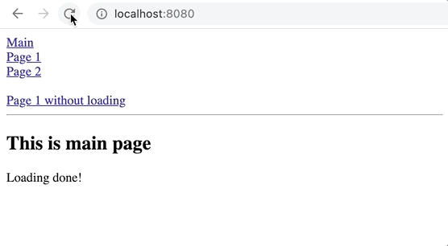

# react-router-loading

Custom react router switch that allows you to load data before switching the screen\
\
[](https://badge.fury.io/js/react-router-loading)

\


<a href="https://codesandbox.io/s/react-router-loading-demo-sguvm" target="_blank">DEMO</a>

## Requirements
```js
"react": "^16.8.0 || ^17.0.0",
"react-dom": "^16.8.0 || ^17.0.0",
"react-router-dom": "^5.0.0"
```

This package uses `react-router-dom` as main router so you should implement it in your project first.

## Installation

```console
npm install react-router-loading
## or
yarn add react-router-loading
```

## Usage

In your router section import `Switch` and `Route` from `react-router-loading` instead of `react-router-dom`
```js
import { Switch, Route } from "react-router-loading";

<Switch>
    <Route path="/page1" component={Page1} />
    <Route path="/page2" component={Page2} />
    ...
</Switch>
```

Add `loading` prop to every route that must be loaded before switching
```js
<Switch>
    // data will be loaded before switching
    <Route path="/page1" component={Page1} loading />

    // instant switch as before
    <Route path="/page2" component={Page2} />
    ...
</Switch>
```

Add `loadingContext.done()` at the end of your initial loading method in components that mentioned in routes with `loading` prop (in this case it's `Page1`)
```js
import { LoadingContext } from "react-router-loading";
const loadingContext = useContext(LoadingContext);

const loading = async () => {
    // loading some data

    // call method to indicate that loading is done and we are ready to switch
    loadingContext.done();
};
```
or for class components
```js
import { LoadingContext } from "react-router-loading";

class ClassComponent extends React.Component {
    ...
    loading = async () => {
        // loading some data

        // call method from props to indicate that loading is done
        this.props.loadingContext.done();
    };
    ...
};

// we should wrap class component with Context Provider to get access to loading methods
const ClassComponentWrapper = (props) =>
    <LoadingContext.Consumer>
        {loadingContext => <ClassComponent loadingContext={loadingContext} {...props} />}
    </LoadingContext.Consumer>

```

## Config

You can specify loading screen that would be shown at the first loading of your app
```js
const MyLoadingScreen = () => <div>Loading...</div>

<Switch loadingScreen={MyLoadingScreen}>
...
</Switch>
```

Use `maxLoadingTime` property if you want to limit loading time. Pages will switch if loading takes more time than specified in this property (ms).
```js
<Switch maxLoadingTime={500}>
...
</Switch>
```

Call `topbar.config()` if you want to change topbar configuration. More info <a href="http://buunguyen.github.io/topbar/" target="_blank">here</a>.
```js
import { topbar } from "react-router-loading";

topbar.config({
    autoRun: false,
    barThickness: 5,
    barColors: {
        0: 'rgba(26,  188, 156, .7)',
        .3: 'rgba(41,  128, 185, .7)',
        1.0: 'rgba(231, 76,  60,  .7)'
    },
    shadowBlur: 5,
    shadowColor: 'red',
    className: 'topbar'
});
```
## How to run example on localhost

Clone repository and run
```
yarn build && yarn start
```

## License

[MIT](./LICENSE)
